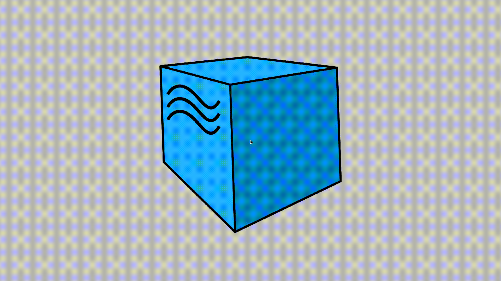
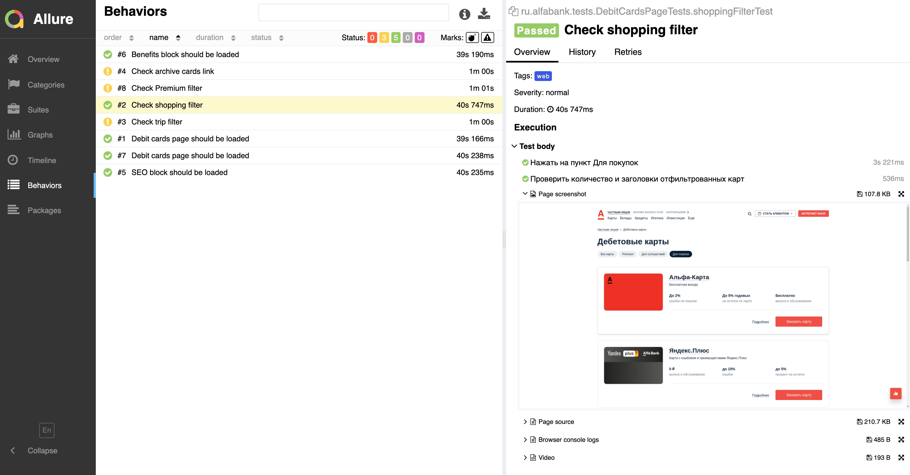
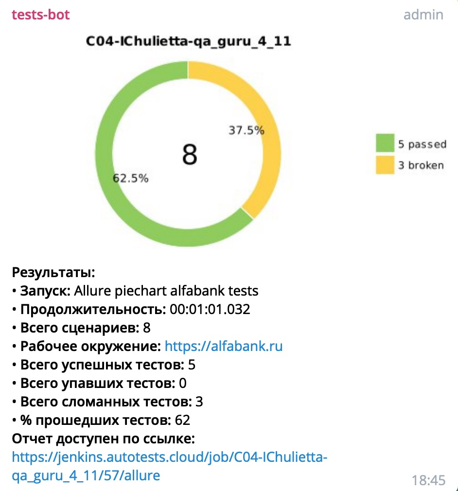

# UI тесты https://alfabank.ru/
Ссылка на задачу в Jenkins https://jenkins.autotests.cloud/view/QA.GURU_4/job/C04-IChulietta-qa_guru_4_11/
## Реализованы проверки страницы "Дебетовые карты" https://alfabank.ru/everyday/debit-cards/
- [X] - Проверка заголовка страницы дебетовых карт
- [X] - Проверка загрузки всех дебетовых карт на странице
- [X] - Проверка перехода по ссылке в архивные карты
- [X] - Проверка фильтрации карт по признаку "Premium"
- [X] - Проверка фильтрации карт по признаку "Для путешествий"
- [X] - Проверка фильтрации карт по признаку "Для покупок"

## Стэк технологий
Java, Gradle, Junit5, Selenide, Allure Reports, Jenkins, Selenoid, Telegram Bot.

## Пример прохождения теста

## Отчёт по прохождению тестов Allure reports

## Уведомление в Telegram
